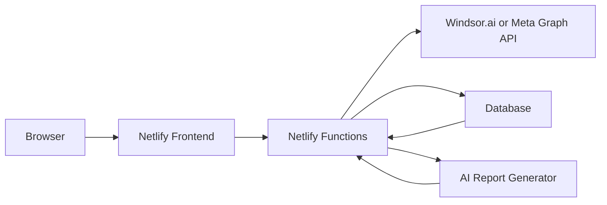

# Implementation Plan

## Goal

Upgrade the free IG account checker into a public, consent-based Instagram analytics product.

## MVP Scope

1. Public quick check
   - User enters an Instagram handle or URL.
   - App returns public/profile-level recommendations.
   - Optional screenshot upload can be analyzed manually or by a vision model later.

2. Authorized analytics
   - User connects their own Instagram professional account.
   - Backend retrieves account, media, story, and audience metrics.
   - App generates a dashboard and Markdown/PDF-ready report.

3. Report output
   - Summary metrics.
   - Reach trend.
   - Top content ranking.
   - Content insights.
   - Weekly action recommendations.

## Production Architecture

## Required Backend Work

- Add user/session model.
- Store connected account IDs and encrypted access tokens.
- Add token refresh or Windsor.ai account mapping.
- Cache daily metrics to reduce API calls.
- Add delete/export user data endpoint.
- Add scheduled weekly report generation.

## Suggested Data Tables

### users

- id
- email
- created_at

### instagram_accounts

- id
- user_id
- provider
- provider_account_id
- username
- access_token_encrypted
- refresh_token_encrypted
- connected_at
- disconnected_at

### instagram_daily_metrics

- id
- instagram_account_id
- date
- reach
- impressions
- profile_views
- website_clicks
- follower_count

### instagram_media_metrics

- id
- instagram_account_id
- media_id
- date
- permalink
- caption
- product_type
- reach
- impressions
- engagement
- saves
- shares
- comments
- likes

### generated_reports

- id
- instagram_account_id
- period_start
- period_end
- markdown
- json
- created_at

## Environment Variables

- `WINDSOR_API_KEY`
- `WINDSOR_API_URL`
- `WINDSOR_INSTAGRAM_ACCOUNT_ID`
- `META_CLIENT_ID`
- `META_CLIENT_SECRET`
- `META_REDIRECT_URI`
- `DATABASE_URL`
- `OPENAI_API_KEY` or preferred AI provider key

## Privacy Requirements

- Full analytics only after explicit user authorization.
- Do not fetch private analytics for arbitrary pasted URLs.
- Make demo/screenshot mode clearly different from connected-data mode.
- Provide data deletion and disconnect controls before public launch.
- Keep all provider tokens server-side only.

## Launch Checklist

- [ ] Connect real Windsor.ai or Meta data API in `instagram-report.js`.
- [ ] Add OAuth callback function.
- [ ] Add database persistence.
- [ ] Add encrypted token storage.
- [ ] Add report generation prompt/service.
- [ ] Add account disconnect/delete-data endpoint.
- [ ] Add terms and privacy page.
- [ ] Submit Meta app review if using Meta Graph API directly.
- [ ] Deploy to Netlify.
- [ ] Run a real account end-to-end test.
