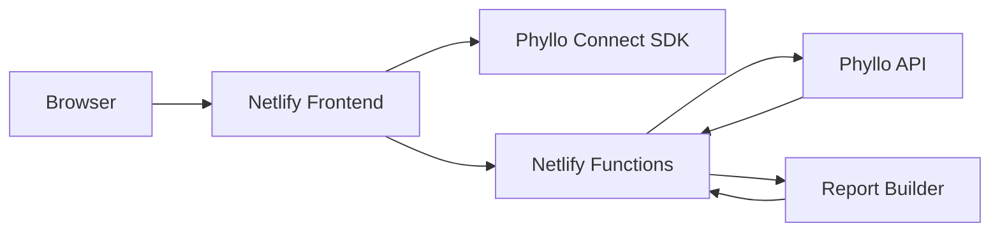

# Implementation Plan

## Goal

Build a public, consent-based Instagram diagnostic product for Taiwanese business owners.

## MVP Scope

1. User fills Instagram handle and industry/service category.
2. User authorizes Instagram data through Phyllo Connect.
3. Backend retrieves the connected account's profile and content performance data from Phyllo.
4. App generates:
   - Summary metrics
   - Reach/content performance trend
   - Top content ranking
   - Main issues and improvement direction
   - Next-week action list

## Production Architecture

## Required Backend Work

- Persist Phyllo user/account IDs in a database instead of only browser localStorage.
- Add webhook handling for Phyllo account/data refresh events.
- Cache daily metrics to reduce API calls.
- Add delete/export user data endpoint implementation.
- Add scheduled report refresh.
- Add AI report generation layer after the metric pipeline is stable.

## Environment Variables

- `PHYLLO_CLIENT_ID`
- `PHYLLO_CLIENT_SECRET`
- `PHYLLO_ENVIRONMENT`
- `PHYLLO_BASE_URL`
- `PHYLLO_INSTAGRAM_WORK_PLATFORM_ID`
- `PHYLLO_CLIENT_DISPLAY_NAME`
- `DATABASE_URL` for a persistent production version
- `OPENAI_API_KEY` or preferred AI provider key for AI-written report expansion

## Privacy Requirements

- Full analytics only after explicit user authorization.
- Do not fetch private analytics for arbitrary pasted URLs.
- Do not display sample analytics as if they came from the user's account.
- Provide data deletion and disconnect controls before public launch.
- Keep all provider credentials server-side only.

## Launch Checklist

- [x] Add Phyllo Connect SDK flow.
- [x] Add Phyllo SDK token function.
- [x] Add Phyllo-backed report endpoint.
- [x] Remove fake report fallback.
- [x] Add initial terms, privacy, config status, and deletion placeholder endpoints.
- [ ] Add production Phyllo credentials in Netlify.
- [ ] Confirm Instagram work platform ID from Phyllo dashboard/API.
- [ ] Run sandbox end-to-end authorization test.
- [ ] Run production account end-to-end test after Phyllo approval.
- [ ] Add persistent database for Phyllo user/account mapping.
- [ ] Add Phyllo webhooks.
- [ ] Deploy to Netlify.
